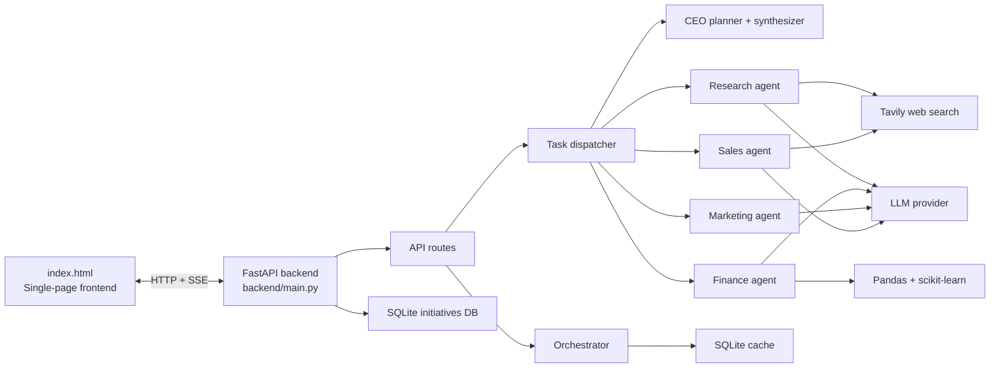
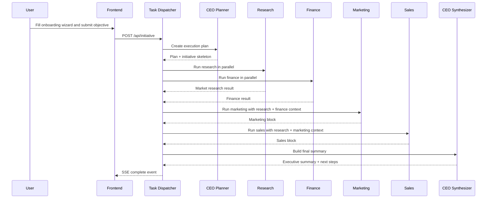

# CompanyOS

CompanyOS is a full-stack AI business operating system that helps a team turn a company idea into a structured launch plan. It collects a company profile, runs a multi-agent planning workflow, performs research and financial analysis, generates marketing and sales outputs, streams progress back to the UI, and stores the final initiative for later retrieval.

This README is intentionally detailed so teammates can understand the project without reading the code first.

## Contents

1. Project overview
2. What the system does
3. Architecture
4. Technology stack
5. Repository structure
6. Backend components
7. Data model and storage
8. API endpoints
9. Frontend behavior
10. Configuration and environment variables
11. Setup and running locally
12. Execution modes
13. SSE event flow
14. Testing and validation
15. Current limitations
16. Suggested team workflow
17. Future improvements

## Project Overview

CompanyOS is designed to behave like a virtual executive team for a business. A user submits a company profile, business details, goals, financial assumptions, team context, and a launch objective. The backend then coordinates specialized agents for CEO planning, research, finance, marketing, and sales. The result is a structured business plan with an executive summary, voice summary, execution plan, and department-specific outputs.

The project is built around four ideas:

- One request produces a complete business planning package.
- Progress is streamed live to the UI with Server-Sent Events.
- Results are cached so identical objectives do not recompute unnecessarily.
- The app supports both demo mode and live API-backed mode.

## What the System Does

At a high level, CompanyOS can:

- Collect a startup or company profile from the frontend onboarding flow.
- Generate an initiative plan from the CEO orchestrator.
- Run real market research through web search when configured.
- Analyze uploaded CSV financial data and forecast revenue trends.
- Generate marketing campaigns, ad copy, audiences, and creative concepts.
- Generate sales prospect lists, scoring, and outreach drafts.
- Execute sandbox marketing and sales actions for review flows.
- Persist results in SQLite and retrieve them later by ID.
- Stream live status updates while the plan is being built.

## Architecture



The frontend is served from the project root. The backend is a FastAPI app that exposes the API, handles caching, and serves the frontend entry point. The agent layer is responsible for the actual business analysis.

## Technology Stack

| Area | Tools |
|---|---|
| Backend framework | FastAPI |
| ASGI server | Uvicorn |
| Data validation | Pydantic v2 |
| ORM and storage | SQLAlchemy + SQLite |
| LLM providers | Google Gemini, OpenAI, Groq |
| Web search | Tavily |
| Data analysis | Pandas, NumPy, scikit-learn |
| HTTP client | httpx |
| Environment loading | python-dotenv |
| Frontend | Vanilla HTML, CSS, JavaScript |
| Streaming | Server-Sent Events |

## Repository Structure

```text
company os/
├── index.html
├── README.md
├── start.bat
├── sample_finance_data.csv
├── test_finance.csv
├── test_*.py
├── backend/
│   ├── main.py
│   ├── models/
│   │   └── db.py
│   ├── prompts/
│   │   ├── agents.py
│   │   └── master.py
│   ├── routes/
│   │   ├── chat.py
│   │   ├── initiative.py
│   │   ├── marketing.py
│   │   └── sales.py
│   ├── schemas/
│   │   └── companyos.py
│   └── services/
│       ├── cache.py
│       ├── orchestrator.py
│       ├── task_dispatcher.py
│       ├── agents/
│       │   ├── finance_agent.py
│       │   ├── marketing_agent.py
│       │   ├── research_agent.py
│       │   └── sales_agent.py
│       ├── execution/
│       │   ├── marketing.py
│       │   └── sales.py
│       └── tools/
│           └── web_search.py
├── storage/
└── stitch_companyos_ai_interface/
    └── stitch_companyos_ai_interface/
        ├── companyos_logo/
        ├── departments_dashboard/
        ├── finance_financial_performance/
        ├── initiative_execution_launching_startup/
        ├── initiative_results_launch_plan/
        ├── marketing_brand_performance/
        ├── new_initiative_companyos/
        ├── overview_companyos/
        └── research_market_intelligence/
```

## Backend Components

### `backend/main.py`

This is the application entry point. It:

- Loads environment variables.
- Initializes the SQLite database on startup.
- Configures CORS for local development.
- Mounts the API routers.
- Serves `index.html` at the root path.
- Falls back to the frontend for non-API routes.

The FastAPI docs are available at:

- `/api/docs`
- `/api/redoc`

### `backend/routes/initiative.py`

This file exposes the main CompanyOS workflow:

- `POST /api/initiative`
- `POST /api/finance/analyze`
- `GET /api/initiative/{initiative_id}`
- `GET /api/initiatives`
- `POST /api/followup`
- `DELETE /api/session`
- `GET /api/health`

The `POST /api/initiative` route is the main entry point. It checks cache first, then streams the task dispatcher output if the request is new.

### `backend/routes/marketing.py`

This route executes a marketing campaign from a generated `MarketingBlock`.

- Default mode is `SANDBOX`.
- `META_LIVE` mode creates a real campaign and ad set in Meta Ads, but keeps them paused.
- Meta credentials are passed in the request body, not stored in the backend.

### `backend/routes/sales.py`

This route executes a sales campaign from a generated `SalesBlock`.

- Default mode is `SANDBOX`.
- The route only sends sandbox results right now.
- It expects approved prospect IDs so the caller can choose which drafts to execute.

### `backend/routes/chat.py`

This is a placeholder route for future conversational features.

- `POST /api/chat`
- Current response: `Chat feature coming soon.`

### `backend/services/task_dispatcher.py`

This is the runtime coordinator for the multi-agent workflow. It is responsible for:

- CEO planning.
- Parallel execution of Research and Finance.
- Sequential dependent execution of Marketing and Sales.
- CEO synthesis of the final response.
- SSE formatting of progress events.

### `backend/services/orchestrator.py`

This module handles LLM calls and single-request orchestration logic. It:

- Reads the active LLM provider and model configuration.
- Supports Gemini, OpenAI, and Groq.
- Validates LLM output against the Pydantic schema.
- Falls back to demo data only when `DEMO_MODE=true`.
- Provides follow-up answer generation for saved initiatives.

### `backend/services/cache.py`

This module hashes a normalized objective and stores the final result in SQLite. If the same objective is submitted again, CompanyOS returns the cached initiative instead of repeating the LLM workflow.

The cache key is based on a normalized objective string, so case and whitespace differences do not create duplicate work.

### `backend/services/agents/*`

These files implement the specialist agents.

- `research_agent.py` handles web search and market analysis.
- `finance_agent.py` handles CSV parsing, metrics, anomaly checks, and forecasting.
- `marketing_agent.py` generates campaign strategy and ad assets.
- `sales_agent.py` finds prospects, scores them, and writes outreach.
- `registry.py` defines agent metadata.

### `backend/services/execution/*`

These files simulate or execute downstream actions.

- `marketing.py` supports sandbox execution and live Meta campaign creation.
- `sales.py` supports sandbox email execution.

### `backend/services/tools/web_search.py`

This is the search integration layer used by research and sales. It currently wraps Tavily search.

### `backend/schemas/companyos.py`

This file defines the request and response models used across the app, including:

- Company profile input.
- Business profile input.
- Goals input.
- Finance input.
- Team input.
- Initiative response schema.
- Marketing and sales block schemas.
- Follow-up request and response models.

## Data Model and Storage

CompanyOS uses SQLite for initiative persistence.

- Default database path: `storage/initiatives.db`
- Table name: `initiatives`
- Primary key: UUID string
- Cached key: SHA-256 hash of the normalized objective

### Initiative Columns

| Column | Purpose |
|---|---|
| `id` | Initiative UUID |
| `objective_hash` | Unique hash of the normalized objective |
| `objective` | Original objective text |
| `result_json` | Full JSON response from CompanyOS |
| `created_at` | UTC creation timestamp |

### Cache Behavior

- The objective is lowercased and whitespace-normalized before hashing.
- Identical objectives reuse the same stored result.
- The research agent also has an in-memory session cache keyed by company name plus objective.

## API Endpoints

### Main Initiative Flow

#### `POST /api/initiative`

Starts the full orchestration workflow and returns an SSE stream.

Expected body shape:

```json
{
  "company": {
    "name": "BeanRush Coffee",
    "industry": "Food & Beverage",
    "stage": "Pre-seed",
    "country": "India",
    "city": "Chandigarh"
  },
  "business": {
    "description": "Tech-enabled grab-and-go coffee shop",
    "business_model": "B2C",
    "target_customers": "Urban professionals aged 22-38",
    "problem": "No fast, high-quality coffee with mobile ordering in Chandigarh",
    "solution": "Mobile app pre-ordering with zero-wait pickup"
  },
  "goals": {
    "primary_goal": "Launch and reach profitability within 8 months",
    "short_term": "500 customers in Month 1",
    "long_term": "Expand to 3 locations by Year 2"
  },
  "finance": {
    "budget": "8.5 Lakh INR",
    "expected_revenue": "1.5 Lakh/month by Month 3",
    "monthly_budget": "88,000 INR",
    "funding_status": "Self-funded"
  },
  "team": {
    "size": "3",
    "founder_role": "CEO & Operations",
    "skills": "Business strategy, coffee industry experience",
    "departments": ["Operations", "Marketing", "Tech"]
  },
  "objective": "Launch a premium coffee startup in Chandigarh targeting young professionals",
  "csv_data": "date,revenue,expenses,marketing_spend\n2025-01,50000,30000,5000\n2025-02,60000,32000,7000"
}
```

#### `POST /api/finance/analyze`

Runs only the finance pipeline and returns SSE events. Use this when you want to test financial analysis without the full initiative flow.

### Stored Initiative Access

#### `GET /api/initiative/{initiative_id}`

Returns a previously generated initiative by ID.

#### `GET /api/initiatives`

Returns a summary list of stored initiatives.

#### `DELETE /api/session`

Deletes all stored initiatives from the database.

### Follow-Up

#### `POST /api/followup`

Answers a question using a stored initiative as context.

Body:

```json
{
  "initiative_id": "uuid-here",
  "question": "What are the biggest risks in this plan?"
}
```

### Health

#### `GET /api/health`

Returns:

```json
{
  "status": "ok",
  "demo_mode": false,
  "llm_provider": "gemini"
}
```

### Marketing Execution

#### `POST /api/marketing/execute`

Executes a marketing block. The request should contain the generated marketing output plus `execution.mode`.

Supported modes:

- `SANDBOX` runs a simulated execution.
- `META_LIVE` creates a real campaign and ad set in Meta Ads Manager, both paused by default.

For `META_LIVE`, include:

```json
{
  "metaCredentials": {
    "accessToken": "...",
    "adAccountId": "..."
  }
}
```

### Sales Execution

#### `POST /api/sales/execute`

Executes approved sales outreach drafts.

Expected shape:

```json
{
  "salesBlock": {
    "execution": { "mode": "SANDBOX" },
    "outreach": [
      { "prospectId": "...", "email": "...", "subject": "...", "body": "...", "status": "DRAFT" }
    ]
  },
  "approvedProspectIds": ["prospect-1", "prospect-2"]
}
```

## Agent Workflow



### Execution order

1. CEO planner creates the task graph.
2. Research and Finance run in parallel.
3. Marketing runs after research and finance are available.
4. Sales runs after research and marketing are available.
5. CEO synthesizer produces the final executive summary.

## SSE Event Flow

The main request returns a stream of events instead of a single JSON payload.

Typical event types:

- `status` for agent state updates.
- `plan` for the CEO task plan.
- `search` for research search results.
- `result` for individual agent results.
- `complete` for the final initiative.
- `error` for failures.

This allows the UI to show progress live while the backend is working.

## Frontend Behavior

The frontend is a single-page app in `index.html`. It is served directly by the FastAPI backend and acts as the main user interface.

The UI includes:

- A multi-step onboarding flow for company input.
- A live execution view for agent status.
- Department dashboards for overview, research, finance, marketing, and sales.
- A JARVIS-style voice summary using browser speech synthesis.
- A dark, enterprise-style visual design.

The UI is designed to display streamed updates as the backend emits them.

## Configuration and Environment Variables

Create a `.env` file at the repository root.

### Supported variables

| Variable | Default | Purpose |
|---|---|---|
| `DATABASE_URL` | `sqlite:///./storage/initiatives.db` | SQLite or custom database URL |
| `DEMO_MODE` | `false` | Use the built-in BeanRush demo response |
| `LLM_PROVIDER` | `gemini` | `gemini`, `openai`, or `groq` |
| `LLM_API_KEY` | empty | API key for the selected LLM provider |
| `GEMINI_MODEL` | `gemini-3.1-flash-lite-preview` | Gemini model name |
| `OPENAI_MODEL` | `gpt-4o` | OpenAI model name |
| `GROQ_MODEL` | `llama-3.1-8b-instant` | Groq model name |
| `TAVILY_API_KEY` | empty | Required for real research and sales web search |

### Example `.env`

```env
DATABASE_URL=sqlite:///./storage/initiatives.db
DEMO_MODE=false
LLM_PROVIDER=gemini
LLM_API_KEY=your_api_key_here
GEMINI_MODEL=gemini-3.1-flash-lite-preview
OPENAI_MODEL=gpt-4o
GROQ_MODEL=llama-3.1-8b-instant
TAVILY_API_KEY=your_tavily_key_here
```

## Setup and Running Locally

### Requirements

- Python 3.10 or newer
- pip
- At least one LLM API key if you want live mode
- Tavily API key if you want research and sales web search

### Install

```bash
python -m venv venv
venv\\Scripts\\activate
pip install -r backend/requirements.txt
```

### Run

```bash
python -m uvicorn backend.main:app --reload --port 8001
```

On Windows, you can also run `start.bat`. It activates the local virtual environment and starts the backend on port 8001.

### Open the app

- Frontend: `http://localhost:8001`
- Swagger UI: `http://localhost:8001/api/docs`
- ReDoc: `http://localhost:8001/api/redoc`

## Execution Modes

### Demo mode

If `DEMO_MODE=true`, the app returns a built-in BeanRush Coffee response instead of calling an LLM. This is useful for demos, onboarding, and UI development without external API keys.

### Live mode

If `DEMO_MODE=false`, CompanyOS uses the configured LLM provider and API key. Live mode also requires Tavily for research and sales search features.

### Marketing live mode

`META_LIVE` creates a real campaign and ad set in Meta Ads but still pauses both objects so nothing spends automatically.

### Sales mode

Sales execution supports two modes:

- `SANDBOX` simulates email sending and does not send real emails.
- `GMAIL_BROWSER` opens Gmail compose drafts in your browser so you can review and send them manually.

## Agent Details

### CEO Orchestrator

The CEO agent creates the plan and final synthesis. It is responsible for structure, sequencing, and overall coherence.

### Research Agent

The research agent:

- Builds 3 to 5 deterministic search queries.
- Searches the web through Tavily.
- Deduplicates results.
- Sends compact snippets to the LLM for synthesis.
- Produces market overview, TAM/SAM/SOM estimates, customers, competitors, opportunities, risks, trends, and sources.

It uses an in-memory session cache to avoid repeating the same search for the same company and objective.

### Finance Agent

The finance agent:

- Reads CSV content from the request.
- Maps common column names like revenue, expenses, marketing spend, customers, orders, and date.
- Computes totals, profit, margins, averages, and growth rates.
- Detects anomalies when month-over-month changes exceed 30 percent.
- Generates a simple linear regression forecast for the next 3 months when enough data exists.
- Uses the LLM to interpret the metrics strategically.

If no CSV is provided, the finance pipeline returns a safe fallback with empty metrics and a note that no dataset was available.

### Marketing Agent

The marketing agent uses company context, research context, and finance context to generate:

- A campaign summary.
- Positioning and messaging.
- Audience details.
- Ad copy.
- Creative concepts.
- Ad sets.
- Risks and recommendations.

The generated output is validated against `MarketingBlock`.

### Sales Agent

The sales agent:

- Builds an ICP from the company profile.
- Uses web search to find prospects.
- Filters obvious non-business results.
- Scores prospects using a deterministic breakdown.
- Scrapes public contact emails when possible.
- Generates outreach drafts with the LLM.

If no email exists, the outreach item is marked `NO_EMAIL`.

## Testing and Validation

The repository includes a set of focused scripts for manual or ad hoc validation:

- `test_finance.py` exercises the finance agent with `test_finance.csv`.
- `test_marketing.py` exercises marketing generation.
- `test_marketing_execution.py` validates the marketing execution provider.
- `test_sales.py` exercises sales prospecting and outreach generation.
- `test_gemini.py` checks Gemini model connectivity and lists available models.

These are useful when making backend changes or verifying environment configuration.

## Current Limitations

- The chat route is only a placeholder.
- Sales execution is sandbox-only and does not send real emails.
- Marketing live mode only creates campaign and ad set objects, not full ad creatives.
- Research and sales depend on Tavily and will fail if the API key is missing.
- Live LLM mode requires a valid API key for the selected provider.
- The frontend is a single large `index.html` file, so changes should be made carefully.

## Suggested Team Workflow

If teammates need to extend the project, this is the usual order of work:

1. Update or add Pydantic schemas in `backend/schemas/companyos.py`.
2. Update prompts in `backend/prompts/` if the output shape changes.
3. Update the relevant agent in `backend/services/agents/`.
4. Update the dispatcher if the orchestration order changes.
5. Update routes if new endpoints or execution modes are added.
6. Update `index.html` so the UI understands the new data.
7. Add or update a test script for the new behavior.

## Future Improvements

- Add a real conversational chat experience.
- Add real sales sending via an email provider.
- Extend marketing execution to support more ad platforms.
- Support multi-user authentication and per-user initiative storage.
- Export the generated plan as PDF.
- Add more robust unit and integration tests.
- Break the monolithic frontend into smaller components.
- Add deployment tooling for containerized or cloud hosting.

## Why This Project Is Useful

CompanyOS is useful for demos, startup planning, and internal strategy reviews because it produces a complete planning package instead of a single answer. It gives the team a shared place to see market research, financial assumptions, execution steps, and go-to-market thinking in one workflow.

If you are new to the codebase, start with `backend/main.py`, then read `backend/services/task_dispatcher.py`, and finally inspect the individual agents.