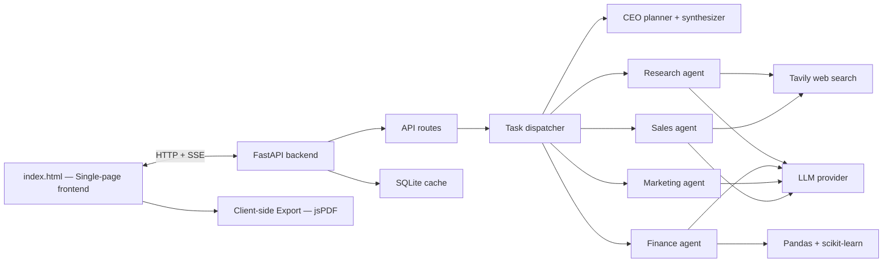
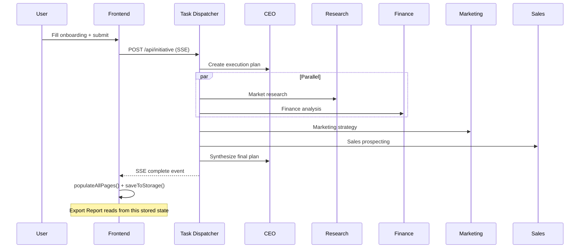

# CompanyOS

CompanyOS is a full-stack AI business operating system that turns a company idea into a structured launch plan. It collects a business profile through an onboarding wizard, coordinates a multi-agent AI workflow (CEO, Research, Finance, Marketing, Sales), streams progress live to the UI, and delivers a complete business plan with actionable recommendations.

## Hackathon Bounty: Export Report

This project implements the **"Generate a project-specific report export"** bounty. Users can export a downloadable PDF, CSV, or HTML report for any generated business profile — containing all captured fields, AI recommendations, statuses, profile readiness, and execution plans.

### Export Feature Highlights

- **Export Report button** on the Initiative Results page with a dropdown for PDF / CSV / HTML
- **Client-side generation** — no server calls, no LLM re-invocation, no data leaves the browser
- **Project-specific** — always exports the currently selected company, never stale or hardcoded data
- **Single normalized model** (`buildBusinessReport`) shared across all three formats so they never disagree
- **Profile readiness** computed from actual captured form fields
- **Safe output** — missing values show "Not provided", never `undefined` / `null` / `[object Object]`
- **Sanitized filenames** — e.g. `BeanRush-Coffee-CompanyOS-Report.pdf`

### Sample Exports (BeanRush Coffee Demo)

Pre-generated samples are included in `sample_exports/` for judging:

| File | Size |
|------|------|
| `BeanRush-Coffee-CompanyOS-Report.pdf` | ~93 KB |
| `BeanRush-Coffee-CompanyOS-Report.csv` | ~14 KB |
| `BeanRush-Coffee-CompanyOS-Report.html` | ~19 KB |

These were generated by flowing the real BeanRush demo profile through the same export pipeline — nothing is hardcoded.

---

## Contents

1. [What the system does](#what-the-system-does)
2. [Architecture](#architecture)
3. [Technology stack](#technology-stack)
4. [Repository structure](#repository-structure)
5. [Setup and running locally](#setup-and-running-locally)
6. [Configuration](#configuration)
7. [Export Report feature](#export-report-feature)
8. [Backend components](#backend-components)
9. [API endpoints](#api-endpoints)
10. [Agent workflow](#agent-workflow)
11. [Frontend behavior](#frontend-behavior)
12. [Execution modes](#execution-modes)

---

## What the System Does

- Collect a startup profile through a 7-step onboarding wizard
- Generate a full business plan via multi-agent AI orchestration (one API call)
- Run real market research through Tavily web search
- Analyze uploaded CSV financial data with Pandas + scikit-learn forecasting
- Generate marketing campaigns, ad copy, audiences, and creative concepts
- Generate sales prospect lists, scoring, and outreach drafts
- Execute sandbox marketing (Meta Ads) and sales actions
- **Export the generated plan as PDF, CSV, or HTML** (client-side, no LLM call)
- Stream live status updates while agents work
- Cache results so identical objectives skip re-computation
- Persist initiatives in SQLite for later retrieval

## Architecture



The frontend is a single `index.html` served by the FastAPI backend. The export feature runs entirely in the browser using jsPDF (CDN) — it reads from the existing in-memory state and generates files locally.

## Technology Stack

| Area | Tools |
|------|-------|
| Backend framework | FastAPI + Uvicorn |
| Data validation | Pydantic v2 |
| Storage | SQLAlchemy + SQLite |
| LLM providers | Google Gemini, OpenAI, Groq |
| Web search | Tavily |
| Data analysis | Pandas, scikit-learn |
| Frontend | Vanilla HTML/CSS/JS, Tailwind CSS (CDN) |
| PDF export | jsPDF 4.2.1 + jsPDF-AutoTable 5.0.8 (CDN) |
| Streaming | Server-Sent Events |

## Repository Structure

```text
company-os/
├── index.html                  # Complete single-page frontend + export logic
├── README.md
├── start.bat                   # Windows launcher
├── .env.example                # Environment template
├── sample_finance_data.csv     # Example CSV for finance agent
├── sample_exports/             # Pre-generated BeanRush sample reports
│   ├── BeanRush-Coffee-CompanyOS-Report.pdf
│   ├── BeanRush-Coffee-CompanyOS-Report.csv
│   └── BeanRush-Coffee-CompanyOS-Report.html
├── backend/
│   ├── main.py                 # App entry point, serves frontend
│   ├── models/
│   │   └── db.py               # SQLAlchemy models
│   ├── prompts/
│   │   ├── master.py           # System + user prompt templates
│   │   └── agents.py           # Per-agent prompts
│   ├── routes/
│   │   ├── initiative.py       # Main orchestration endpoint (SSE)
│   │   ├── marketing.py        # Marketing execution
│   │   ├── sales.py            # Sales execution
│   │   └── chat.py             # Placeholder
│   ├── schemas/
│   │   └── companyos.py        # Pydantic request/response models
│   └── services/
│       ├── orchestrator.py     # LLM calls, demo mode
│       ├── task_dispatcher.py  # Multi-agent coordination
│       ├── cache.py            # Result caching
│       ├── agents/
│       │   ├── research_agent.py
│       │   ├── finance_agent.py
│       │   ├── marketing_agent.py
│       │   └── sales_agent.py
│       ├── execution/
│       │   ├── marketing.py    # Meta Ads integration
│       │   └── sales.py        # Email sandbox
│       └── tools/
│           └── web_search.py   # Tavily wrapper
└── stitch_companyos_ai_interface/  # UI design reference screenshots
```

## Setup and Running Locally

### Requirements

- Python 3.10+
- An LLM API key (Gemini, OpenAI, or Groq)
- Tavily API key (for real web search in Research and Sales agents)

### Install

```bash
python -m venv venv
venv\Scripts\activate        # Windows
# source venv/bin/activate   # macOS/Linux
pip install -r backend/requirements.txt
```

### Configure

Copy `.env.example` to `.env` and fill in your keys:

```env
LLM_PROVIDER=groq
LLM_API_KEY=your_key_here
TAVILY_API_KEY=your_tavily_key_here
DEMO_MODE=false
```

### Run

```bash
python -m uvicorn backend.main:app --reload --port 8001
```

Or on Windows: double-click `start.bat`.

### Open

- App: http://localhost:8001
- Swagger: http://localhost:8001/api/docs

## Configuration

| Variable | Default | Purpose |
|----------|---------|---------|
| `DEMO_MODE` | `false` | Return pre-built BeanRush response (no LLM) |
| `LLM_PROVIDER` | `gemini` | `gemini`, `openai`, or `groq` |
| `LLM_API_KEY` | — | API key for the selected provider |
| `GEMINI_MODEL` | `gemini-3.1-flash-lite-preview` | Gemini model |
| `OPENAI_MODEL` | `gpt-4o` | OpenAI model |
| `GROQ_MODEL` | `llama-3.1-8b-instant` | Groq model |
| `TAVILY_API_KEY` | — | For real web search |
| `PORT` | `8000` | Server port |

---

## Export Report Feature

### How It Works

1. User creates a company and generates a plan (via the normal flow)
2. On the **Initiative Results** page, click **Export Report**
3. Choose **Download PDF**, **Download CSV**, or **Download HTML**
4. The file downloads immediately — no API call, no LLM invocation

### What's Included in the Report

| Section | Source |
|---------|--------|
| Company Information | `COMPANY_STATE.currentCompany.company` (from onboarding form) |
| Business Details | `COMPANY_STATE.currentCompany.business` |
| Goals | `COMPANY_STATE.currentCompany.goals` |
| Financial Information | `COMPANY_STATE.currentCompany.finance` |
| Team & Operations | `COMPANY_STATE.currentCompany.team` |
| Business Objective | `COMPANY_STATE.currentCompany.objective` |
| Profile Readiness | Computed from actual field completeness |
| Recommendations | `COMPANY_STATE.companyResult.recommendations` |
| Next Steps | `COMPANY_STATE.companyResult.next_steps` |
| Agent Statuses | `COMPANY_STATE.companyResult.agents.{ceo,research,finance,marketing,sales}` |
| Execution Statuses | Marketing + Sales execution status |
| Notes | Checked across profile/result (falls back to "No notes provided") |
| Research Insights | Full research block (market, competitors, opportunities, risks) |
| Finance Insights | Metrics, cost breakdown, forecasts |
| Marketing Insights | Strategy, campaigns, channels, ad copy |
| Sales Insights | Pricing, channels, targets, ICP, prospects |
| Execution Plan | Week-by-week action items with owners |

### Technical Implementation

- **One normalized model**: `buildBusinessReport(profile, companyResult)` — all three formats read from this
- **PDF**: jsPDF + AutoTable with professional layout, page numbers, section headers
- **CSV**: RFC-compliant with UTF-8 BOM (for Excel), columns: `Section, Field, Value, Status, Source`
- **HTML**: Fully standalone (inline CSS, no external deps, no `<script>` tags)
- **No regeneration**: Export reads existing state only, never calls `/api/initiative`
- **Dependencies**: jsPDF 4.2.1 + jsPDF-AutoTable 5.0.8 via CDN (no npm/build step needed)

### Verification

The feature was tested end-to-end with Playwright (headless Chromium):

- PDF downloads with valid `%PDF-` header (58KB+)
- CSV contains correct company data, recommendations, readiness
- HTML renders standalone without the app running
- Different companies produce different reports (no stale data)
- Missing fields show "Not provided" (never undefined/null)
- Zero `/api/initiative` network calls during export

---

## Backend Components

### Task Dispatcher (`backend/services/task_dispatcher.py`)

Coordinates the multi-agent workflow:

1. CEO Planner creates the execution plan
2. Research + Finance run in parallel
3. Marketing runs after research/finance complete
4. Sales runs after research/marketing complete
5. CEO Synthesizer produces the final executive summary

### Orchestrator (`backend/services/orchestrator.py`)

Handles LLM calls, response validation, and repair attempts. Supports Gemini, OpenAI, and Groq. Falls back to demo data only when `DEMO_MODE=true`.

### Agents

| Agent | Responsibilities |
|-------|-----------------|
| Research | Web search via Tavily, market analysis, TAM/SAM/SOM, competitors |
| Finance | CSV parsing, metrics, anomaly detection, linear regression forecast |
| Marketing | Campaign strategy, ad copy, creative concepts, audience targeting |
| Sales | ICP generation, prospect finding + scoring, outreach drafts |

## API Endpoints

| Method | Path | Purpose |
|--------|------|---------|
| `POST` | `/api/initiative` | Main orchestration (SSE stream) |
| `POST` | `/api/finance/analyze` | Standalone finance analysis (SSE) |
| `GET` | `/api/initiative/{id}` | Retrieve saved initiative |
| `GET` | `/api/initiatives` | List all initiatives |
| `POST` | `/api/followup` | Ask a follow-up question |
| `DELETE` | `/api/session` | Clear all stored data |
| `GET` | `/api/health` | Health check |
| `POST` | `/api/marketing/execute` | Execute marketing campaign |
| `POST` | `/api/sales/execute` | Execute sales outreach |

## Agent Workflow



## Frontend Behavior

The frontend is a single `index.html` (~4300 lines) with:

- 7-step onboarding wizard with form validation
- Live execution view showing agent progress via SSE
- Department dashboards (Overview, Company, Research, Finance, Marketing, Sales)
- JARVIS voice assistant (browser speech synthesis + follow-up questions)
- **Export Report** dropdown (PDF/CSV/HTML) on the Results page
- Dark enterprise theme with Tailwind CSS
- localStorage persistence for session continuity

## Execution Modes

| Mode | What Happens |
|------|-------------|
| **Demo** (`DEMO_MODE=true`) | Returns pre-built BeanRush response, no LLM call |
| **Live** (`DEMO_MODE=false`) | Full multi-agent orchestration with real LLM + web search |
| **Marketing Sandbox** | Simulated campaign execution |
| **Marketing Meta Live** | Creates real Meta Ads campaign (paused) |
| **Sales Sandbox** | Simulated email outreach |
| **Sales Gmail Browser** | Opens Gmail compose drafts for manual review |

---

## Quick Start (Demo)

The fastest way to see the export feature:

1. Run the server: `start.bat` or `python -m uvicorn backend.main:app --port 8001`
2. Open http://localhost:8001
3. Click **Try Demo** (uses BeanRush Coffee)
4. Wait for generation to complete, click **View Results**
5. At the bottom of the Results page, click **Export Report**
6. Choose PDF, CSV, or HTML — the file downloads instantly

No API key needed if `DEMO_MODE=true` in `.env`.
